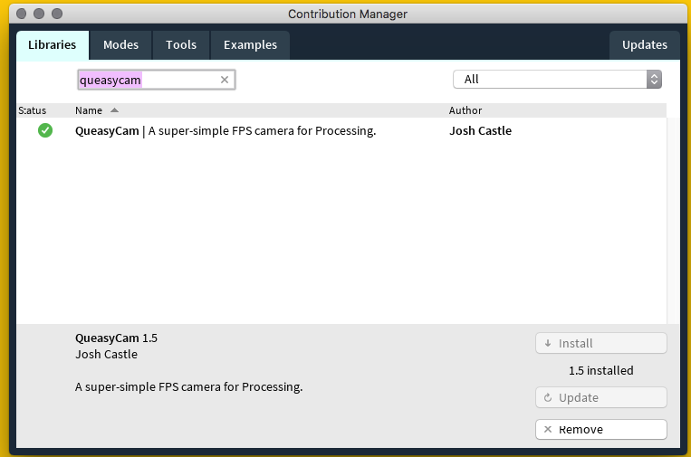
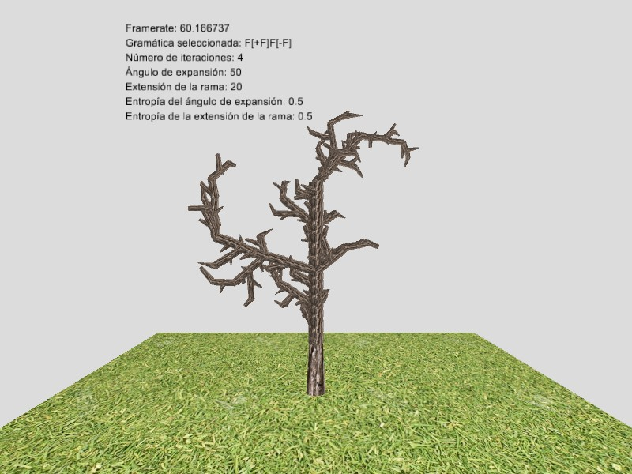
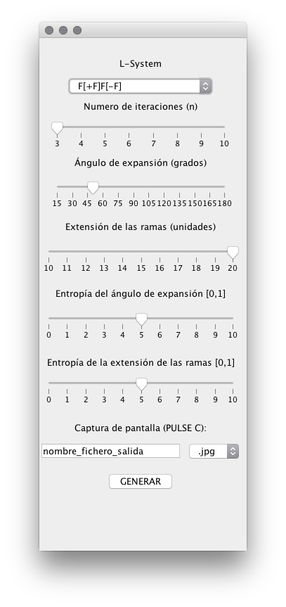

# Representación de LSystem
:office: Universidad de Huelva (UHU) - Escuela Técnica Superior de Ingeniería (ETSI)  
:calendar: Curso 2019-2020  
:mortar_board: Realidad Virtual  
:construction_worker: [Francisco Jesús Beltrán Moreno (@FranBeltranM)](https://github.com/FranBeltranM)  
:construction_worker: [Manuel Jesús Grávalos Cano (@MGravalos)](https://github.com/MGravalos)  

## Dependencias

  

Para la cámara libre [0].

## Introducción
En este repositorio se ha tratado de desarrollar una representación en el entorno [Processing](https://processing.org/) del sistema de generación de árboles fractales [LSystem](https://es.wikipedia.org/wiki/Sistema-L).

  

## Estructura del proyecto
El proyecto se basa en 4 ficheros:
- **Main**: Como su nombre indica es el fichero principal, desde él realizaremos las distintas llamadas a los demás ficheros y en él se encuentra el **draw()** (dibuja nuestro árbol) y el **setup()** (inicializa las variables y demás elementos).
- **LSystem**: Este fichero contiene todo el código que se encarga de generar la grámatica, con ella podemos generar nuestro árbol.
- **dibujaFormas**: Fichero auxiliar que nos ayudará a generar visualmente nuestras ramas y aplicarle las texturas correspondientes.
- **Menu**: Es el encargado de solicitar los datos al usuario.

## Interfaz de Java

  

- **L-System**: Nos permite elegir entre distintas gramáticas.
- **Número de iteraciones (n)**: Cuántas veces vamos a iterar nuestro árbol.
- **Ángulo de expansión (grados)**: Posibles valores con los que podría orientarse nuestra rama.
- **Extensión de la rama (unidades)**: Longitud de la rama.
- **Entropía del ángulo de expansión [0,1]**: Coeficiente entre 0 y 1 del desorden que podría producirse al calcular el ángulo.
- **Entropía de la extensión de la rama [0,1]**: Coeficiente entre 0 y 1 del desorden que podría producirse al calcular la longitud de la rama.
- **Captura de pantalla**: Indicando en el cuadro de texto, al pulsar la tecla correspondiente nos generará una captura de ese instante.

## Controles de la cámara
- **IMPORTANTE: TODO EL MOVIMIENTO ES USANDO LOS BOTONES INDICADOS MÁS LA RULETA DEL RATÓN**
- **A EXCEPCIÓN DEL MOVIMIENTO DEL RATÓN QUE ES LIBRE**
- **X**: Cambiará los valores del eje X.
- **Y**: Cambiará los valores del eje Y.
- **Z**: Cambiará los valores del eje Z.
- **V**: Giro vertical.
- **H**: Giro horizontal.
- **C**: Captura de pantalla.

## Símbología de L-System
- **F**: Dibujar una rama.
- **+**: Giro a izquierdas de la rama.
- **-**: Giro a derechas de la rama.
- **[**: Inicio de una nueva rama.
- **]**: Fin de la rama.

## Referencias
- Como código fuente del L-System se ha usado el trabajo de **Daniel John Jones** [1].
- Para la representación de las ramas mediante cilindros se ha usado el artículo **Drawing a Cylinder with Processing** [2].
- Para entender el concepto de nodos y su uso se ha usado este post de **StackOverflow** [3].
- Agradecimientos a los compañeros **@IgorMy** y **@Narovik**, por su explicación de aspectos referentes a la creación de los nodos de conexiones, en su trabajo es conocido como vectorPesos[].

## Bibliografía
[0] https://discourse.processing.org/t/queasycam-controlling-functions-with-cp5/9944/2  
[1] http://www.erase.net/projects/l-systems/  
[2] https://stackoverflow.com/questions/16129537/how-to-animate-a-3d-curve-between-two-points-on-a-map  
[3] https://vormplus.be/full-articles/drawing-a-cylinder-with-processing  
[4] http://30min-processing.hatenablog.com/entry/2016/02/18/000000  
[5] https://processing.org/tutorials/p3d/  
[6] https://github.com/ambron60/l-system-drawing  
[7] https://processing.org/examples/keyboard.html  
[8] https://processing.org/examples/mousefunctions.html  
[9] https://processing.org/reference/camera_.html
